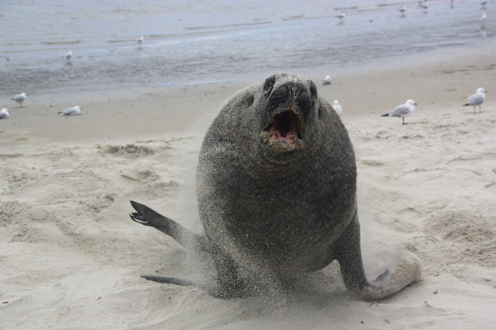
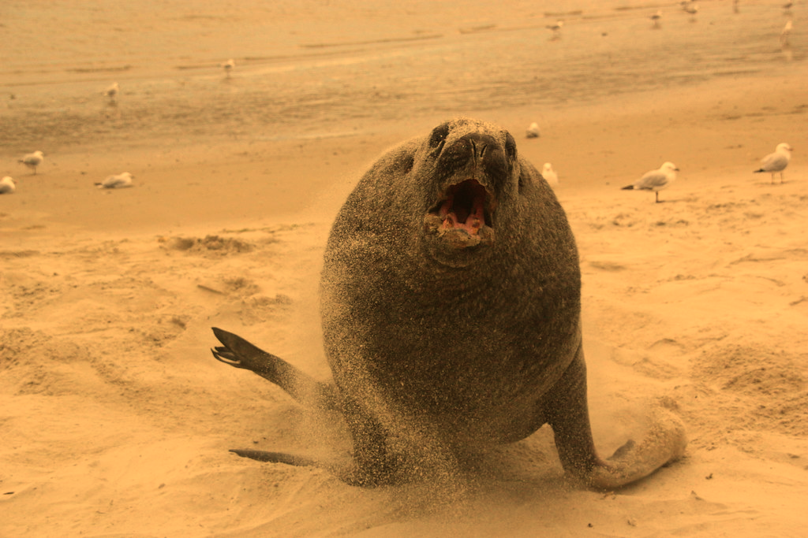
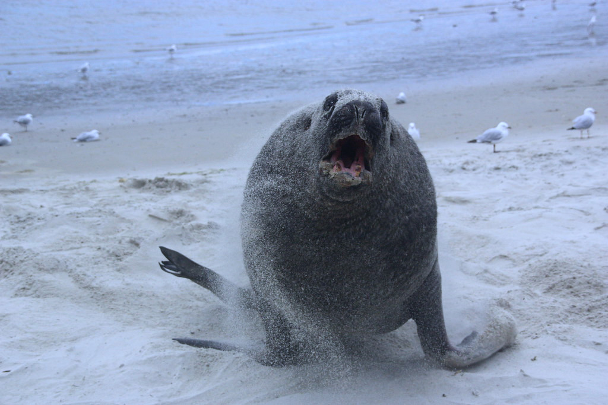
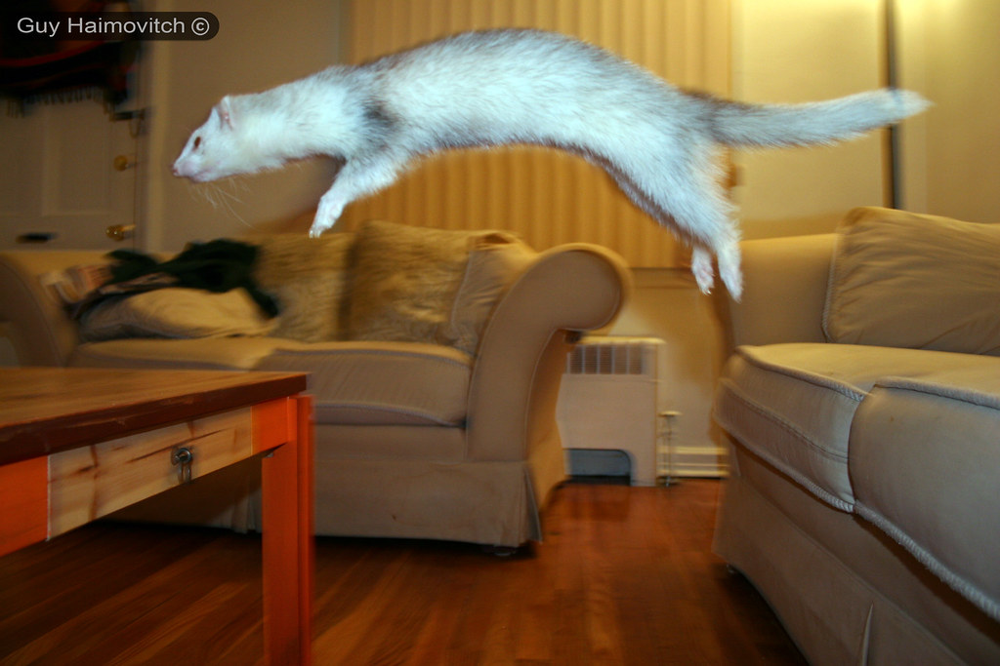
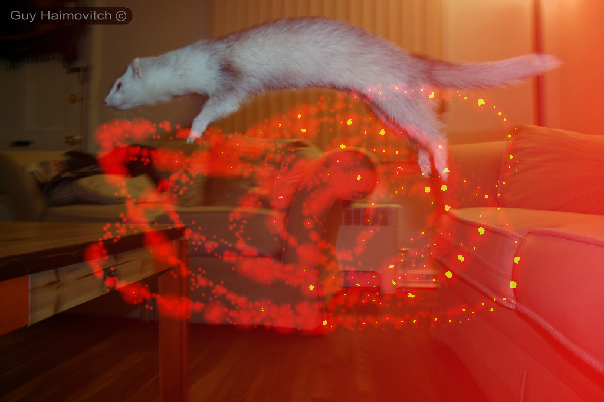
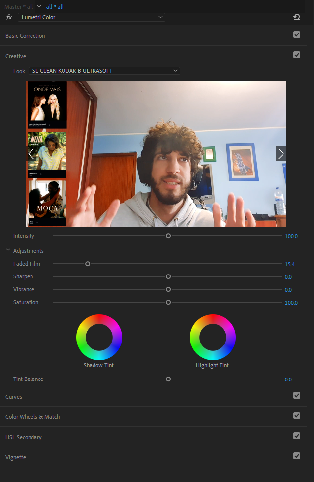
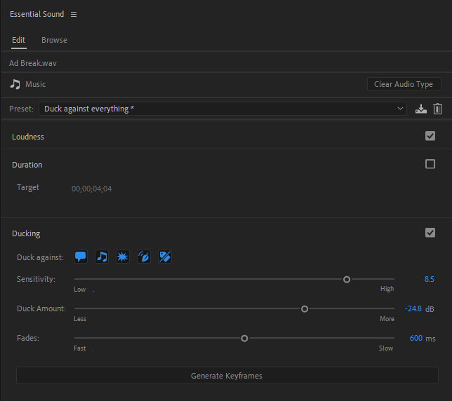

# Prod_Multimedia

## Testes de temperatura de cor

### Cor normal

### cor hot

### cor cold

--------------------------------------------------------------------------------------

### foto original

### foto hard mixed com uma layer que contem um gradient de preto para vermelho e um pincel

---------------------------------------------------------------------------------------

## testar o darktabe

###  foto original

### foto editada

#LINKES

##GIMP

Make a transparent gradient in gimp
https://www.youtube.com/watch?v=wXoa3DXasZU

GIMP 2020 - How to Resize/Scale an Image or Layer
https://www.youtube.com/watch?v=Kfy0i8Gd1vk

##VIDEO

color correction

efeito para a musica nao dar clash com as vozes

som

#LINKS

Adobe in a Minute 
vi demasiados videos deste canal para meter todos os links. Este canal salvou-me muitas vezes
https://www.youtube.com/channel/UCCOCVxg0ZiLo6GQ0xctkM7g

How to Remove Background Noise
https://www.youtube.com/watch?v=25ZFA1xfMfU

How to Use Key Frames
https://www.youtube.com/watch?v=n9eVnr2grWQ

How to Create Rolling Film Credits
https://www.youtube.com/watch?v=ayxE2mVaW-4

How to Color Correct
https://www.youtube.com/watch?v=0VDbf9VsZ88

Premiere Pro Transitions
https://www.youtube.com/watch?v=LCQxvl_YmTw
